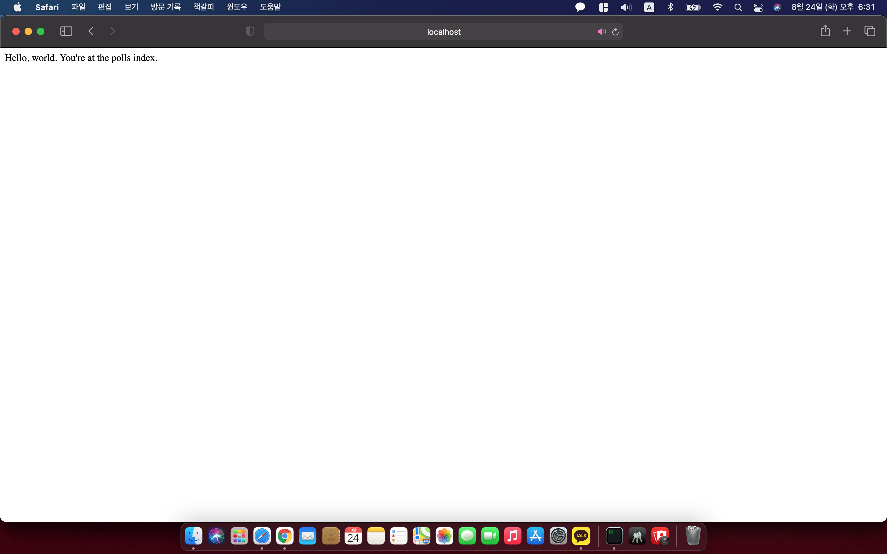

# django_study
## django 시작하기

### 8/23
1. 파이썬 설치
2. 장고 설치
<pre><code>
python -m pip install Django

</code></pre>
3. 설치 확인
<pre><code>
>>> import django
>>> print(django.get_version())
3.2
</code></pre>

## django project 만들기
1. project 생성
<pre><code>
python3 -m django startproject {project name}
</code></pre>
2. prject tree
<pre><code>
preject/
    manage.py
    mysite/
        __init__.py
        settings.py
        urls.py
        asgi.py
        wsgi.py
</code></pre>

* manage.py : 프로젝트와 상호작용하는 커맨드라인 유틸리
* settings.py : 프로젝트 환경 및 구성 저장
* urls.py : 프로젝트의 URL 선언 저장
* asgi.py : AGSI 웹서버의 엔트리포인트
* wsgi.py : WSGI 호환 웹 서버의 포인트

3. project 시작
<pre><code>
python3 manage.py runserver
</code></pre>
* App 만들기
<pre><code>
python3 manage.py startapp {app name}
</code></pre>
App의 트리를 보면 다음과 같다.
<pre><code>
app_name/
    __init__.py
    admin.py
    apps.py
    migrations/
        __init__.py
    models.py
    tests.py
    views.py

</code></pre>

### 8/24
* view 작성
app에 views.py를 수정한다. 
<pre><code>
from django.http import HttpResponse

def index(request):
    return HttpResponse("Hello, world. You're at the polls index.")

</code></pre>
코드를 작성한 후에 뷰를 호출하려면 URL을 연결해주어야 하는데 url을 연결하려면 app에있는 urls.py와 project에 있는 urls.py를 둘 다 수정해 주어야 한다.

* app urls.py
<pre><code>
from django.urls import path

from . import views

urlpatterns = [
    path('', views.index, name='index'),
]

</code></pre>

* project urls.py
<pre><code>
from django.contrib import admin
from django.urls import include, path

urlpatterns = [
    path('polls/', include('polls.urls')),
    path('admin/', admin.site.urls),
]

</code></pre>

### 8/25

4. 데이터베이스 설치
* 데이터베이스 바인딩을 설치한 후 settings.py 에서 Database default 값을 변경
> 'django.db.backends.sqlite3', 'django.db.backends.postgresql', 'django.db.backends.mysql', 또는 'django.db.backends.oracle' 로 변경

5. 모델 만들기

* 모델 : 부가적인 메타데이터를 가진 데이터베이스의 구
> Django는 DRY 원칙을 따른다
>> DRY : Do not Reapeat Yourself의 약자로 반복하지 말 것 이란 뜻으로 고유한 개념 및 데이터는 단 한번, 한 곳에만 존재해야한. 모델도 마찬가지로 한 곳에만 저장되는 것이 좋다.

> 데이터베이스의 각 필드는 Field 클래스의 인스턴스로 표현, 각 필드가 어떤 자료형을 가질 수 있는지 말해준다
> 각각의 Field 인스턴스의 이름은 machine friendly format
> Field 클래스의 생성자에 선택적으로 human-readable로 지정할 수도 있
> 몇몇 클래스는 필수 인수가 필요하고 또한 다양한 선택적 인수를 가지는 필드도 존재
> ForeignKey를 사용하여 관계 설정이 가능하다.

